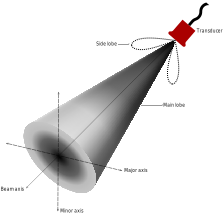

:xrefstyle: short

This Appendix was reproduced from the Echoview(R) https://support.echoview.com/WebHelp/Echoview.htm[help file] with permission from https://www.echoview.com/[Echoview Software] Pty Ltd, Australia.

Three axes for describing beam geometry are beam axis, minor axis and major axis (<<beam_geometry_figure>>). Range from the transducer is measured along the beam axis and position in the beam is measured from the beam axis (along the minor and major axes). Minor and major are axis naming conventions, and different manufacturers have adopted different naming conventions for the two axes. Equivalent axis terminology for leading brands of echosounders are:

[cols=",,",options="header",]
|===
|*Manufacturer* |*Preferred minor axis terminology* |*Preferred major axis terminology*
|BioSonics |Minor |Major
|HTI |Up-down |Left-right
|Simrad |Alongship or Longitudinal |Athwartship or Transversal
|Precision Acoustic Systems |y |x
|===

.Illustrates the beam geometry and axis system.
[[beam_geometry_figure]]

