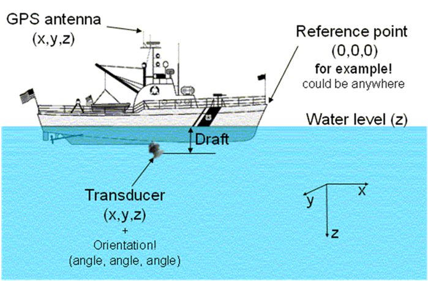

This Appendix was reproduced with permission from the Echoview 5.1 help file (see also http://www.echoview.com[www.echoview.com]).

*About transducer geometry*

Transducer geometry in Echoview refers to the configurable location and orientation of http://support.echoview.com/WebHelp/Reference/Glossary.htm#Transducer[transducers]. This page covers:

* Overview of transducer geometry
* About transducer location
* About transducer orientation

For information about how transducer geometry affects displayed data and exports, see http://support.echoview.com/WebHelp/Using_Echoview/What_is_effected_by_transducer_geometry.htm[What is affected by transducer geometry].

*Overview of transducer geometry*

Each transducer may be located in space and oriented as desired. Illustrated below is a schematic displaying the relative positions in space of a reference point, a GPS antenna and a transducer with non-vertical orientation. How to define location and orientation for each transducer is described below.

Transducers are always associated with a http://support.echoview.com/WebHelp/Reference/Glossary.htm#Platform[platform]. The reference point of the platform is at (0,0,0) by definition and defines the position of the platform in the real world (that is, the platform is considered to be, in the real world, wherever it's reference point is).

The position of the reference point is not explicitly entered in Echoview, but all other positions are entered relative to it, wherever it may be.

Please note that the positive Z direction is downwards when the X-Y plane is horizontal (considered to be on a rigid platform that does not pitch and roll).

For many applications, such as a typical ship based echo integration survey with multiple downward looking transducers, the only aspect of transducer geometry required is the definition of transducer depth (http://support.echoview.com/WebHelp/Using_Echoview/About_transducer_draft.htm[draft]), if desired. Other applications, such as multiple frequency TS techniques, surveys with non-vertical transducers, and applications that require the position of samples to be precisely located in the world, Echoview's transducer geometry settings allow full specification of the transducer set up.

Echoview transducer geometry settings allow enough information to be stored about the location and orientation of transducers and GPS antennas to determine the geographic coordinates of any sample or single target in the acoustic beam - given the assumption of a stable platform with no pitch and no roll. In Echoview, some data formats may support roll data or roll and pitch data. For further information regarding relevant data formats and the effects of using roll and pitch data see http://support.echoview.com/WebHelp/Files,_filesets_and_variables/Variables/About_roll_data.htm[About roll data] and http://support.echoview.com/WebHelp/Files,_filesets_and_variables/Variables/About_pitch_data.htm[About pitch data].

Note: Transducer geometry calculations are not used in Echoview for calculating the geographic position of lines (and hence bathymetric data). Bottom picks are assumed to be at the position of the GPS antenna even if the beam is pointing at some angle to the vertical and the transducer is offset from the Reference point.

*About transducer location*

The relative location of the water level and GPS antenna and the location of each transducer are defined on the http://support.echoview.com/WebHelp/Windows_and_Dialog_Boxes/Dialog_Boxes/Transducer_Properties_dialog_box.htm#Location_page[Location page] of the http://support.echoview.com/WebHelp/Windows_and_Dialog_Boxes/Dialog_Boxes/Transducer_Properties_dialog_box.htm[Transducer Properties dialog box].

Locations are all defined relative to a system reference point. The system reference point may be any point defined relative to the transducer platform (it is not defined explicitly in Echoview, the locations of transducers, GPS antenna and water level are defined relative to it).

The coordinate system utilises three axes (X, Y and Z) and their orientation depends upon whether the platform is fixed or mobile.

*Fixed Platform*

The location of the system reference point is specified in geographic coordinates (latitude, longitude and altitude).

* The X axis is defined to run south-north (positive northwards, negative southwards)
* The Y axis is defined to run west-east (positive eastwards, negative westwards)
* The Z axis is defined to run vertically (positive downwards, negative upward)

*Mobile Platform*

The geographic location (latitude, longitude and altitude) of the GPS antenna is measured by a Global Positioning System (GPS) device. The location of the GPS antenna relative to the system reference point is specified in X, Y, Z coordinates (m). Hence the geographic location of the system reference point and the location of the face of each transducer can be determined in geographic coordinates (latitude, longitude and altitude) from the known position of the GPS antenna.

* The X axis is defined to run alongship (positive towards the bow, negative towards the stern)
* The Y axis is defined to run athwartship (positive towards starboard, negative towards port)
* The Z axis is considered to run vertically (positive downwards, negative upwards)

To determine the geographic location of a sample point or a single target in geographic coordinates it is also necessary to define the orientation of the transducer.

*About transducer orientation*

Transducers are not only located, but also oriented - that is, they point somewhere. Like location, orientation requires three parameters to be specified, in this case angles rather than coordinates. The orientation for each transducer is defined on the http://support.echoview.com/WebHelp/Windows_and_Dialog_Boxes/Dialog_Boxes/Transducer_Properties_dialog_box.htm#Orientation_page[Orientation page] of the http://support.echoview.com/WebHelp/Windows_and_Dialog_Boxes/Dialog_Boxes/Transducer_Properties_dialog_box.htm[TransducerProperties dialog box].

The X-Y-Z axes as defined above are taken as a reference for orientation. In summary:

[cols=",",]
|===
a|*For fixed platforms:*

* The X axis runs south-north
* The Y axis runs west-east
* The Z axis runs up-down

a|*For mobile platforms:*

* The X axis runs stern-bow
* The Y axis runs port-starboard
* The Z axis runs up-down
|===

Two angles are used to define the direction in which the acoustic axis is pointing (either elevation and azimuth angles or alongship and athwartship angles). A third angle called the rotation defines the direction of the http://support.echoview.com/WebHelp/Reference/Glossary.htm#Minor-axis[minor axis] of the transducer relative to a vertical plane passing through the http://support.echoview.com/WebHelp/Reference/Glossary.htm#beam_axis[beam axis]. The rotation of the transducer can only be determined after the definition of the beam direction.

*Elevation and Azimuth*

The angles are defined as follows:

* *Elevation* is the angle between the beam axis and the positive Z axis. +
 +
Valid range is 0° to 180°.

[%autowidth]
|===
|0° |defines a vertically downward pointing beam
|90° |a horizontal beam
|180° |a vertically upward pointing beam
|===

* *Azimuth* is the angle between the beam axis and the positive X axis (measured clockwise when viewed in the positive Z direction). +
 +
Valid range is 0° to 360° .

[%autowidth]
|===
|0° |defines a northward (or forward) pointing beam
|90° |eastward (or starboard) pointing
|180° |southward (or aft) pointing
|270° |westward (or port) pointing
|===

If the elevation is 0° or 180° then Azimuth is equivalent to a rotation.

*Along and Athwartship (Mobile Platform only)*

The angles are defined as follows:

* *Alongship* is the angle between the beam axis and the Y-Z plane. +
 +
Valid range is -180° to 180° .

[%autowidth]
|===
|0° |defines a downward pointing beam in the Y-Z plane
|-90° |a horizontal aft pointing beam
|90° |a horizontal forward pointing beam
|-180° |an upward pointing beam in the Y-Z plane
|180° |an upward pointing beam in the Y-Z plane
|===

* *Athwartship* is the angle between the beam axis and the X-Z plane.  +
 +
Valid range is -180° to 180° .

[%autowidth]
|===
|0° |defines a downward pointing beam in the X-Z plane
|-90° |a horizontal port pointing beam
|90° |degrees a horizontal starboard pointing beam
|-180° |an upward pointing beam in the X-Z plane
|180° |an upward pointing beam in the X-Z plane
|===

*Note:* Not all combinations of Alongship and Athwartship angle are valid. If one angle defines a downward pointing beam (-90° to 90°) and the other an upward pointing beam (-180° to -90° or 90° to 180°)  they cannot be describing the same direction!

*Rotation*

* *Rotation* is the angle between the positive http://support.echoview.com/WebHelp/Reference/Glossary.htm#Minor-axis[minor-axis] of the transducer and the vertical plane running through the beam axis (measured in the clockwise direction as seen from the transducer).

Valid range is 0° to 360°.
[%autowidth]
|===
|0° |an upward pointing positive minor-axis
|180° |a downward pointing positive minor-axis
|===

*In Summary*

To determine the three coordinates defining the beam orientation do the following:

. Determine the pointing direction of the beam axis
+
Use your choice of either elevation-azimuth angles or alongship-athwartship angles.
. Determine the rotation angle of the transducer
+
Remember that the zero reference for the rotation angle is the vertical plane running through the beam axis and therefore that the rotation coordinate can only be meaningfully determined after you have defined the orientation of the beam axis.

*Examples:*

* A transducer beam pointing to starboard at an angle of 45 degrees with the positive minor axis of the transducer pointing forward is defined by either: +
 +
elevation = 45° , azimuth = 90° , rotation = 270° +
 +
-OR- +
 +
alongship = 0° , athwartship = 45° , rotation = 270° +
 

* A transducer beam pointing to port at an angle of 45 degrees with the positive minor axis of the transducer pointing forward is defined by either: +
 +
elevation = 45° , azimuth = 270° , rotation = 90° +
 +
-OR- +
 +
alongship = 0° , athwartship = -45° , rotation = 90°

*Notes:*

* You may define the pointing direction of the transducer with whichever pair of angles is most convenient for your application but the rotation angle will be the same, whichever pair of angles you choose to define the pointing direction.

* For a transducer with an elevation of 0° (that is, vertically downward pointing), the azimuth angle is logically equivalent to the transducer rotation. Echoview does not adjust the rotation angle on the dialog if you specify an azimuth without any elevation. We recommend, for clarity, that you do not use a non-zero azimuth with a zero elevation.
