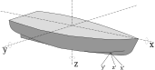

= The SONAR-netCDF4 convention for sonar data, Version 1.0
Gavin Macaulay <gavin.macaulay@hi.no>; Héctor Peña <hector.pena@hi.no>
:toc: left
:toclevels: 3
:doctype: book
:revnumber: 1.8
:xrefstyle: short
:source-highlighter: highlightjs
:highlightjsdir: highlight
:sectnumslevels: 4
:stem: latexmath
:eqnums:
:bibtex-file: references.bib
:bibtex-style: ices-journal-of-marine-science

// a future version of Asciidoctor will use the 'untitled' option to now show the heading
[colophon%untitled]
== Colophon
International Council for the Exploration of the Sea +
Conseil International pour l’Exploration de la Mer

{empty}H. C. Andersens Boulevard 44-46  +
DK-1553 Copenhagen V +
Denmark +
Telephone (+45) 33 38 67 00 +
Telefax (+45) 33 93 42 15 +
http://www.ices.dk[www.ices.dk] +
info@ices.dk

Recommended format for purposes of citation:

Macaulay, G. and Peña, H. (Eds.). 2018. The SONAR-netCDF4 convention for sonar data, Version 1.0. ICES Cooperative Research Report No. 341. 33 pp. http://doi.org/10.17895/ices.pub.4392

Series Editor: Emory D. Anderson

The material in this report may be reused for non-commercial purposes using the recommended citation. ICES may only grant usage rights of information, data, images, graphs, etc. of which it has ownership. For other third-party material cited in this report, you must contact the original copyright holder for permission. For citation of datasets or use of data to be included in other databases, please refer to the latest ICES data policy on ICES website. All extracts must be acknowledged. For other reproduction requests please contact the General Secretary.

This document is the product of an expert group under the auspices of the International Council for the Exploration of the Sea and does not necessarily represent the view of the Council.

Cover image: (C) OCEANA/Carlos Suárez

http://doi.org/10.17895/ices.pub.4392 +
ISBN 978-87-7482-214-1 +
ISSN 1017-6195

(C) 2018 International Council for the Exploration of the Sea

:sectnums!:
== Foreword
:sectnums:

This report documents a convention for the storage of sonar data in netCDF4-formatted computer files, with an initial focus on omnisonars. The intention is to provide a well-founded convention that is supported by multiple sonar systems and multiple sonar analysis software packages, with the aim of facilitating the use of sonar data for research and survey purposes. The name of this convention is SONAR-netCDF4.

This document was developed by the Topic Group on Defining a data format for omnidirectional fisheries sonar, part of ICES Working Group on Fisheries Acoustics, Science, and Technology (WGFAST).

== Introduction

Sonars have long been used to study and understand fisheries and the aquatic environment, but only recently have they directly provided digital data for quantitative analysis. Each manufacturer typically provides such data in a proprietary, but usually open, file format specific to their sonar systems. This hinders the effective use and exchange of such data by requiring the development and maintenance of file-reading software for multiple analysis programs and multiple sonars.

This document presents a convention for the storage and exchange of fisheries sonar data, with an initial focus on omnisonars. It is sufficiently generic and flexible to contain all foreseeable types of fisheries sonar data, along with necessary metadata. It also serves as a statement of the minimum set of data and metadata required to use omnisonar data in a quantitative manner.

=== Background

Many purpose-built file formats exist to store and exchange data from scientific and industrial equipment. Formats have been created by sonar and echosounder manufacturers; in addition, more generic acoustic data formats such as the Generic Water Column (GWC) format cite:[geeMultibeamWaterColumn2012], the eXtended Triton Format (XTF; citenp:[triton2013]), and the HydroACoustics (HAC) format cite:[mcquinn2005] have also been created. These formats store a time-ordered sequence of datagrams, making it easy to append new data. Other data, such as geographical position, are typically interleaved into the sequence of datagrams. However, this is not optimal for analysis purposes when data are viewed and analysed as a set of pings and metadata from a time-period or spatial grouping. In addition, efficient random-read access to individual pings is not possible unless an index is available or created.

The Topic Group on Defining a data format for omnidirectional fisheries sonar do not want to create yet another sonar-specific file format; the knowledge required is not within the expertise of this group. However, the group does have the expertise to specify what data must be stored to allow for unambiguous use of backscatter data during quantitative analysis.

Accordingly, an existing file-format definition has been utilized and what should be stored is specified. The requirements for such a file format definition were:

* ability to adequately represent the content and structure of sonar data and associated metadata;
* standardized, open-file format;
* fast random access to data stored in the file;
* ability to store multiple types of data (e.g. position and backscatter);
* ability to store metadata (e.g. sonar settings);
* freely available and open libraries to read the data files into programming languages and technical computing environments (e.g. Java, C, C++, Python, Matlab, and R);
* reliable and space-efficient format for data exchange and storage;
* self-describing file format;
* backwards compatibility upon modification of the file contents specification (i.e. old software/tools can still read relevant parts of a newer version);
* computer platform-independent;
* long-term support and extensive use in other scientific fields;
* support for very large datasets.

Other scientific communities that collect and produce voluminous amounts of data have addressed similar needs, resulting in the Hierarchical Data Format cite:[thehdfgroup2017], currently at version 5 (HDF5). This is the only file format that meets all the listed requirements and is utilized for sonar data. There are two realizations of the HDF5 file format: (i) HDF5 itself and (ii) netCDF4 cite:[unidata2017], which is a subset of HDF5. Both are sufficient, but netCDF4 is more widely used and has slightly wider language support and implementation diversity. Accordingly, netCDF4 has been chosen.

Using a well-supported file format has the significant benefit that many data exploration, query, extraction, and analysis tools already read such files. This eliminates the need to develop and maintain sonar-specific file-reading software and facilitates the use of existing tools for data management, distribution, and analysis (a pertinent example is OPeNDAP, which provides a network-transparent standard for distributing scientific data).

An attractive feature of netCDF4 is the ease and transparency with which data can be added to an existing netCDF4 file. For example, processed data and how it was obtained can be included in the same file as the raw data. In addition, netCDF4 files can be very large while still providing fast access to data subsets. This allows a single SONAR-netCDF4 file to contain data from a transect or an entire survey. These features would simplify data management, improve traceability and long-term storage of analysis, enhance the sharing of processed datasets, and facilitate analysis of large disparate datasets. In general, any amount of additional data can be stored in the files without affecting the ability to use the data specified by the SONAR-netCDF4 convention.

A distinction is commonly made between file formats designed for archiving data in the original form, formats designed for storing partially or fully processed data, and formats for data exchange cite:[jackson2014]. The SONAR-netCDF4 convention is intended to be suitable for all of these.

The initial focus of this convention has been to specify the storage of backscatter amplitude data from omnisonars. It is envisaged that future versions could specify how to store data from other acoustic equipment (e.g. echosounders) and derived data (e.g. bottom and school detections, categorization of backscatter, and integrated backscatter at multiple resolutions). Ancillary information such as sonar display screen-grabs could also be stored.

=== Versioning

This document and the convention that it describes will change over time to implement enhancements and to correct errors and omissions. To accommodate this, the SONAR-netCDF4 convention always requires a version number. This document has a separate version number, allowing for revised versions of the document to describe the same version of the convention.

The convention version number will always be included in the title of the document. The document version number will always be found in <<_revision_history>>.

== The SONAR-netCDF4 convention

=== Introduction

NetCDF4 is a data model, application programming interface (API) library, and file format for storing and managing data, developed and maintained by Unidata. Unidata is part of the US University Corporation for Atmospheric Research (http://www2.ucar.edu/[UCAR]) Community Programs (http://www.ucp.ucar.edu/[UCP]) and funded primarily by the US National Science Foundation.

SONAR-netCDF4 is a data and metadata convention for the storage of data from active sonars in netCDF4 formatted files. SONAR-netCDF4 consists primarily of a naming convention and a data structure within the netCDF4 data model.

Datasets can be added to SONAR-netCDF4 files if they do not conflict with the SONAR-netCDF4 datasets. If such additions are potentially of use to other users of the file format, it is recommended that they be proposed for inclusion in this or additional convention specifications.

Each SONAR-netCDF4 file is intended to store data from one sonar mounted on one platform. The storage of data from multiple sonars and multiple platforms in one SONAR-netCDF4 file is not in the scope of the convention.

A design principle of SONAR-netCDF4 has been to focus on describing the acoustic backscatter data, not the overall purpose and context of why the data were collected. Such broader metadata are better stored in separate metadata systems and schema (e.g. citenp:[iso2014,ices2016]).

=== Hierarchical structure

NetCDF4 has two main organizational concepts: (i) the variable, which can contain a variety of data structures, and (ii) groups, being a collection of variables. Groups and variables can have attributes attached to them. Groups can be arranged into a hierarchy.

SONAR-netCDF4 divides sonar data into seven netCDF4 groups:

. *Top-level –* contains metadata about the SONAR-netCDF4 file format;
. *Annotation –* contains time-stamped annotations;
. *Environment –* contains information relevant to acoustic propagation through water;
. *Platform* *–* contains information about the platform on which the sonar is installed;
. *Provenance –* contains metadata about how the SONAR-netCDF4 version of the data were obtained;
. *Sonar –* contains the backscatter and associated metadata; groups under Sonar are used for storing data from different sonar operating modes;
. *Vendor specific –* contains vendor-specific information about the sonar and the data.

These groups contain variables and variable attributes with prescribed names and contents.

=== Obligations and missing data

Some variables and attributes in SONAR-netCD4 are mandatory; these form the minimal set of data required to quantitatively use backscattering amplitude data. The remaining variables and attributes have various levels of optionality and provide enhanced context and information about the sonar data. The obligations are:

. *M*: mandatory
. *MA*: mandatory if applicable or available
. *R*: recommended
. *O*: optional

Any non-mandatory variables can be absent from a SONAR-netCDF4 file. If a variable is mandatory, it must be present and must contain data. The set of mandatory variables and attributes has been chosen so that omnisonar systems can directly generate SONAR-netCDF4-conforming files without needing survey, experiment, or cruise-specific data.

The _FillValue attribute should be used to indicate missing data in variables. For floating point values, the IEEE 754 not-a-number (NaN) is the preferred fill value as this is convenient for commonly-used analysis packages (e.g. Python, Matlab, R).

=== Metadata and authorities

The fisheries acoustics community has developed a metadata convention for processed acoustic data cite:[ices2016]. Where relevant, attribute and variable names have been reused from this convention. The NetCDF Climate and Forecast (CF) Metadata Conventions cite:[eatonNetCDFClimateForecast2017] have been used where sensible (the efficient storage of unprocessed active sonar data has not been a design goal of the CF convention) along with the ESIP Attribute Convention for Data Discovery (ACDD). Terms and concepts from other metadata conventions have also been used where appropriate.

=== Units

All relevant variables and attributes in SONAR-netCDF4 files are required to have a textual netCDF4 attribute with the name “units” that specifies the units. The International System of Units (SI) is used. For simplicity, the data format mandates the use of particular units and their textual form, as per the definitions and conventions of the UDUNITS-2 package cite:[ucar2014]. Decibels are commonly used in underwater acoustic quantities, but UDUNITS does not currently include such a unit. However, as the CF convention does permit decibel (with symbols: “dB”, “db”, and “dbel”), it is used in the SONAR-netCDF4 convention.

=== Datatypes

Each item has a suggested datatype, chosen to have sufficient range and precision to contain the expected data. Alternative datatypes can be used if necessary, but are discouraged. The “string” type should contain text in the UTF-8 encoding and should be treated as case-sensitive during any comparisons. Enumerated datatypes are used for some of the controlled vocabularies.

=== Vocabularies

The contents of some variables and attributes are restricted to defined vocabularies. These are listed or referenced where required. Desired additions to the vocabularies should be proposed to WGFAST for incorporation into this document. Some of the vocabularies have been represented as netCDF4 enumeration data types and some using the CF flag_values convention.

=== File-naming convention

SONAR-netCDF4 files should always end with a “.nc” suffix to indicate that they are a netCDF file. It is recommended that the filename should sort alphanumerically into chronological order (e.g. date and time of the first ping in the file; thus: YYYYMMDD-HHMMSS.nc). This facilitates file management and use in analysis systems.

=== CDL version of SONAR-netCDF4

An example of a SONAR-netCDF4 file is provided in the Common Data form Language (CDL). This provides a more formalized and structured representation of the data format. A CDL file can be converted into a NetCDF file using the “ncgen” utility (available as part of the netCDF software distribution) and then used as a template for creating populated SONAR-netCDF4 files.

=== Groups

==== Top-level group

The top-level group contains metadata about the SONAR-netCDF4 file, represented as attributes in the group (<<topLevelTable>>).

.Description of the top-level group.
[cols=",,",options="header",]
[[topLevelTable]]
include::tableToplevel.adoc[]

==== Annotation group

The annotation group contains timestamped annotations with optional identification code. Annotations are typically textual notes entered by users relevant to the data at a particular time. Some sonar systems provide an interface for creating manual and programmatic annotations. The netCDF4 group name is */Annotation* and is described in <<annotationTable>>.

.Description of the annotation group.
[cols=",,",options="header",]
[[annotationTable]]
include::tableAnnotation.adoc[]

==== Environment group

The environment group contains information on environmental conditions, especially the speed of sound in water and acoustic absorption. The netCDF4 group name is */Environment* and is described in <<environmentTable>>. Sound speed, absorption, and current profiles can also be stored in this group, as can profile measurements of salinity, temperature, and pressure. Such profile data should use the NCEI NetCDF “profile” template, v2.0 or greater.

.Description of the environment group.
[cols=",,",options="header",]
[[environmentTable]]
include::tableEnvironment.adoc[]

==== Platform group

This group contains information about the sonar platform (e.g. ship). The netCDF4 group name is */Platform* and is described in <<platformGroupTable>>. The coordinate system convention, including the definition of pitch and roll, is detailed in <<_coordinate_systems>>.

Optionally, /Platform subgroups can be included to store data from individual instruments. This would provide a standard place to store unprocessed and unparsed instrument data from multiple GPS sensors, motion reference units, etc. The data format is not prescribed, but could, for example, be NMEA-style text and/or numeric values. Subgroups must have one attribute called “description” that provides a short description of the contents. Other attributes can be added as desired. The variables under the subgroup should have appropriate names and an attribute that gives the units, where appropriate. If NMEA telegrams are stored, it is suggested that the group name is NMEA and follows the convention described in <<NMEATable>>.

.Description of the platform group.
[cols=",,",options="header",]
[[platformGroupTable]]
include::tablePlatform.adoc[]

.Suggested group for storing NMEA datagrams from marine instruments.
[cols=",,",options="header",]
[[NMEATable]]
include::tableNMEA.adoc[]

==== Provenance group

The provenance group provides information on how the SONAR-netCDF4 version of the data were created. The netCDF4 group name is */Provenance* and is described in <<provenanceTable>>.

.Description of the provenance group.
[cols=",,",options="header",]
[[provenanceTable]]
include::tableProvenance.adoc[]

==== Sonar group

This group contains the sonar backscatter data and associated metadata. The netCDF4 group name is */Sonar* and is described in <<sonarGroupTable>>.

Data from each beam mode (e.g. horizontal and vertical beam modes) are stored in subgroups under the /Sonar group (see <<sonarBeammodeTable>>). The form of the backscatter data can vary between different sonar systems. For example, some provide a complex-valued amplitude, while others provide a real- or integer-valued amplitude. Variable definitions for data from split-aperture systems are not currently specified.

Subgroups under /Sonar each have a coordinate variable that contains ping timestamps. In some cases the coordinate variables in different subgroups contain the same data (such as when a sonar produces several types of beam data from each and every ping). To avoid duplication of timestamp data, a coordinate variable can be used across multiple subgroups. For organisational reasons, it is then recommended that such coordinate variables be located in the /Sonar group. 

.Description of the sonar group.
[cols=",,",options="header",]
[[sonarGroupTable]]
include::tableSonar.adoc[]

.Description of the beam mode subgroups of the sonar group.
[cols=",,",options="header",]
[[sonarBeammodeTable]]
include::tableBeamGroup1.adoc[]

==== Vendor specific group

The vendor specific group contains information about the sonar and data specific to the sonar. Data in this group must not be necessary for normal quantitative use of the sonar data. The contents of this group are at the discretion of the sonar and software that writes the SONAR-netCDF4 file. The netCDF4 group name is */Vendor_specific*. Currently, there is no mandatory information for the vendor specific group.

== Conversion equations

This section provides detailed formulae on how to convert the backscatter data in the Sonar group into calibrated target strength and volume backscatter strength.

=== Type 1

Type 1 conversion equations are used for data recorded by the Simrad SU90, SX90, and SH90 omnisonars and are presented in detail by citenp:[macaulay2016].

The complex-valued backscatter data are converted into calibrated target strength via:

[stem]
++++
TS = 10 \log_{10}(P_{r}) + 40\log_{10}(r) + 2\alpha r - 10\log10_{10}( \frac{P_t\lambda^{2}}{16\pi^2}) - G - 40\log_{10}(\cos\gamma),
++++

where latexmath:[P_r] is linearly proportional to the received power (square of the magnitude of the complex number given by backscatter_r and backscatter_i, W) and _r_ is the range between the transducer and target, calculated from:

[stem]
++++
r = \frac{c ( dt \cdot i - t_0 )}{2},
++++

where _c_ is sound speed (NetCDF4 variable is sound_speed_indicative, m/s), _dt_ is the time between recorded samples (sample_interval, s), _i_ is the sample number (from zero to one less than the number of samples), and latexmath:[t_0] is a time-offset (sample_time_offset, s).

The absorption coefficient of sound in water is _α_ (absorption_indicative, dB/m), latexmath:[P_t] is the transmit power (transmit_power, W), latexmath:[\lambda] is the acoustic wavelength (derived from the average of transmit_frequency_start and transmit_frequency_stop, and sound_speed_indicative, m), _G_ is the transducer gain (transducer_gain, dB)_,_ and latexmath:[\gamma] is the beam tilt angle (derived from beam_direction_x, beam_direction_y, beam_direction_z, degrees from horizontal).

The volume backscatter strength (Sv, citenp:[maclennan2002]) is derived from a similar equation:

[stem]
++++
S_{v} = 10\log_{10}(P_{r}) + 20\log_{10}(r) + 2\alpha r - 10\log_{10}(\frac{P_t\lambda^{2}c\psi\tau_{e}}{32\pi^{2}}) - G - 40\log_{10}(\cos\gamma),
++++

where latexmath:[\psi] is the equivalent beam angle (equivalent_beam_angle, sr), latexmath:[\tau_e] is the effective pulse duration (transmit_duration_equivalent, s), and _G_ is the transducer gain (transducer_gain, dB).

=== Type 2

Type 2 conversion equations are intended for data recorded by Furuno omnisonars. The received real-valued backscatter data are converted into calibrated target strength via:

[stem]
++++
TS = 20\log_{10}(\frac{A}{\sqrt{2}}) + 40\log_{10}(r) + 2\alpha r - (SL + K + \Delta G + G_{T}),
++++

where _A_ (backscatter_r, 1) is linearly proportional to the amplitude of the received echo , _r_ is the range as given by equation (2), and _α_ is the absorption coefficient of sound in water (absorption_indicative, dB/m). _SL_ is source level (transmit_source_level, dB re 1μPa at 1 m) and _K_ is receiver sensitivity (receiver_sensitivity, dB re 1/μPa). Both parameters may depend on tilt angle of the beam for transmitting and receiving.

Gain correction, latexmath:[\Delta G], (gain_correction, dB) is determined by the calibration. Time-varied gain, latexmath:[G_T] (time_varied_gain, dB), is given at each sample number _i_.

The volume backscatter strength is derived from a similar equation:

[stem]
++++
S_v = 20\log_{10}(\frac{A}{\sqrt{2}}) + 20\log_{10}(r) + 2\alpha r - 10\log_{10}( \frac{c\tau_e}{2}\Psi ) - (SL + K + \Delta G + G_T),
++++

where _c_ is sound speed (sound_speed_indicative, m/s), latexmath:[\tau_e] is the effective pulse duration (transmit_duration_equivalent, s), and latexmath:[\Psi] is the equivalent beam angle (equivalent_beam_angle, sr). Considering the time-varied-gain (TVG) effect on the echo shape cite:[sawada1993], the replacement of _r_ by latexmath:[r - r_0], where latexmath:[r_0 = \frac{1}{4} c \tau_e], is recommended cite:[maclennan1986,furusawaRangeErrorsSound1999] for calculation of latexmath:[S_v].

== Coordinate systems

=== Platform coordinate system

The coordinate system for the platform uses the right-handed Cartesian convention (<<coordinate_system_figure>>) with:

* _x_-axis parallel to the main axis of the platform, positive values toward the front of the platform (e.g. toward the bow of a ship),
* _y_-axis perpendicular to the main axis of the platform, positive values to the starboard side of the platform,
* _z_-axis vertical, positive values down from the platform,
* the origin is the common reference point where all three axes meet and is arbitrary.

Roll is positive with port side up, pitch is positive with bow up, and heading/yaw is positive clockwise. More specifically:

* looking along the positive _x_-axis, a positive rotation (roll) is clockwise (to starboard),
* looking along the positive _y_-axis, a positive rotation (pitch) is clockwise (bow up),
* looking along the positive _z_-axis, a positive rotation (yaw) is clockwise (to starboard).

The platform-heading variable (degrees clockwise from north) can be used to obtain the sonar orientation in world coordinates. This applies to both stationary and mobile sonar platforms.

The orientation of the platform is represented using the _z_–_y_’–_x_” Tait-Bryan intrinsic rotation convention (https://en.wikipedia.org/wiki/Euler_angles[en.wikipedia.org/wiki/Euler_angles]), corresponding to yaw, pitch, and roll, respectively. Intrinsic means that rotations about the _y_-axis are measured after any rotation about the _z_-axis, and rotations about the _x_-axis are measured after rotations about the _y_-axis (for comparison, extrinsic angles are applied relative to a fixed-platform orientation). This is the most used rotation convention in the maritime field, and the main effect is that roll is measured relative to the plane tilted by the pitch angle.

.Platform coordinate system. The arrows on the axes indicate the positive direction and the arrows around each axis indicate positive rotations (Hull drawing based on image from Simrad SN90 manual, redrawn with permission).
[[coordinate_system_figure]]

=== Sonar beam coordinate system

The coordinate system for beam direction uses the same convention as the platform coordinate system, but with the origin at the transducer. Sonar beams can be compensated or uncompensated for platform motion. If uncompensated, the sonar beam coordinate system follows the yaw, pitch, and roll of the platform. If beams are compensated, the sonar beam coordinate system is translated and rotated per ping so that the _y_-axis is always horizontal and the _z_-axis is always vertical. The _x_-axis is always parallel to the platform’s _x_-axis. The beam stabilisation variable indicates whether the beams are compensated or uncompensated.

=== Coordinate systems offsets and rotations

Several coordinate system offsets can be given in the Platform group. These allow for precise specification of the origin of sensors, such as the position and attitude sensors, and sonar transducer. The offset is a (x,y,z) tuple in the platform coordinate system. Offsets are to be interpreted as a vector that starts at the platform coordinate system origin and ends at the sensor position. For example, an offset of (1, 2, –3) indicates a position that is 1 m toward the bow, 2 m to starboard, and 3 m above the origin of the platform coordinate system.

Some sensors (e.g. the attitude sensor) can have a rotation relative to the platform-coordinate system. This is represented as the extrinsic rotation required from the platform coordinate system’s _x_-, _y_-, and _z_-axes to arrive at the sensor’s _x_-, _y_-, and _z_-axes.

== Revision history

[cols=",,,",options="header",]
|===
|Document version |SONAR-netCDF4 version |Date |Changes
|{revnumber}|1.0 | |
|1.7 |1.0 |29 May 2018 |Modifications due to ICES CRR review and editorial process.
|1.6 |1.0 |7 Feburary 2018 |Modifications due to further Topic Group input.
|1.5 |1.0 |20 December 2017 |Formatted to ICES CRR style
|1.4 |1.0 |18 September 2017 |Added additional CF attributes to time variables. From Topic Group input: incorporation of Type 2 equation and additional variables to support it. Consistency and clarity corrections.
|1.3 |1.0 |21 June 2017 |Extensive and significant modifications derived from feedback on v1.2, from creation of test SONAR-HDF4 files, and from implementation of reading in LSSS.
|1.2 |1.0 |2 February 2017 |Further modifications after internal review.
|1.1 |1.0 |13 January 2017 |Modifications after generation of test datasets.
|1.0 |1.0 |22 December 2016 |Draft version for distribution to ICES WGFAST Topic Group on “Defining a data format for omni fisheries sonar”.
|===

== Acknowledgements

We are grateful for the thorough and considered contributions from the Marine Acoustics Society of Japan’s Technical Committee. Advice and experience on the practicalities of reading netCDF files in analysis software was generously provided by Christian Michelsen Research AS, Echoview Software, and Nortek AS. Sindre Vatnehol and Arne Johannes Holmin kindly developed software to generate SONAR-netCDF4 files. We also thank Elodie Fernandez and Jim Biard for their invaluable reviews and suggestions for improving both the convention and this document.

== References

bibliography::[]

:sectnums!:
== Annex 1: Working with netCDF4 files

NetCDF4 files are not commonly used for fisheries acoustics data. To facilitate the use of such files, this section provides simple examples of how to access and use SONAR-netCDF4 files in commonly used programming languages, namely Python, R, and Matlab.

.Python example
[source,python]
----
# Import packages needed to read and view data from netcdf4
from netCDF4 import Dataset
import numpy as np
import matplotlib.pyplot as plt

# Name of the netcdf file
filename = 'SU90-D20171107-T195023.nc'

# Open the file
dataset = Dataset(filename)

# Open the group where the backscatter data is located
SonarGr = dataset.groups['Sonar'].groups['Beam_group2']

# Get the backscatter data from the 10th ping and and 31st beam
back_r = SonarGr.variables['backscatter_r'][9,30]
back_i = SonarGr.variables['backscatter_i'][9,30]

# Close dataset
dataset.close()

# Compute the power
power = abs(np.vectorize(complex)(back_r,back_i))**2

# Plot the power of beam
plt.figure(1)
plt.clf()
plt.plot(10*np.log10(power))
plt.xlabel('Sample number')
plt.ylabel('Amplitude [dB]')
----

.R example
[source,r]
----
library(h5)
SU90_nc <- PATH_TO_SONAR_NETCDF4_FILE

# The h5 package is able to read the example file:
data <- h5file(SU90_nc)

# Show the contents:
data

# List the dimensions of the data sets:
ds <- list.datasets(data)
dims <- lapply(ds, function(x) openDataSet(data, x)@dim)
names(dims) <- ds
dims

# Note that the backscatter data are stored as variable 
# length datatype, so the dimensions in 'dims' does not 
# reflect to the full size of the backscatter data. 
# In this particular file the length of all beams and all 
# pings of both Beam_group1 and Beam_group2 are identical:

bs_r1_name <- "/Sonar/Beam_group2/backscatter_r"
bs_i1_name <- "/Sonar/Beam_group2/backscatter_i"

# Save the real part and set dimension to 
# [length of beams, number of beams, number of pings]:
backscatter1 <- complex(
real=unlist(data[bs_r1_name][10,31]), 
imaginary=unlist(data[bs_i1_name][10,31]))
power <- abs(backscatter1)^2

# Plot the first and second beam of the third ping:
plot(10*log10(power), type="l", 
ylab="Power", xlab="Sample number")

# Close the file:
h5close(data)
----

.Matlab example
[source,matlab]
----
% Example Matlab script to load a SONAR-netCDF4 file using the
% high-level HDF5 functions.

% File to read
file = 'SU90-D20171107-T195023.nc';

% Ping and beam to read
pingNo = 10;
beamNo = 31;

% Read the selected ping/beam from the file
amp_r = h5read(file, '/Sonar/Beam_group2/backscatter_r', [beamNo pingNo], [1 1]);
amp_i = h5read(file, '/Sonar/Beam_group2/backscatter_i', [beamNo pingNo], [1 1]);

% Calculate the power values for the ping.
power = abs(complex(cell2mat(amp_r), cell2mat(amp_i))).^2;

% Plot the power
plot(10*log10(power))
xlabel('Sample number')
ylabel('Power (dB)')
----

== Annex 2: Contact information

[cols=",",options="header",]
|===
2+|*Editors* 
a|
*Gavin John Macaulay*

Institute of Marine Research, Norway

mailto:gavin.macaulay@hi.no[gavin.macaulay@hi.no]
a|
*Héctor Peña*

Institute of Marine Research, Norway

mailto:hector.pena@hi.no[hector.pena@hi.no]

2+|**Members of the Topic Group on Defining a data format for omnidirectional fisheries sonar** (part of ICES Working Group on Fisheries Acoustics, Science, and Technology)
a|
*Akira Okunishi*

Furuno Electric Co. Ltd., Japan

mailto:akira.okunishi@furuno.co.jp[akira.okunishi@furuno.co.jp]
a|
*Christophe Cobieres*

iXblue SAS, France

mailto:christophe.corbieres@ixblue.com[christophe.corbieres@ixblue.com]
a|
*Arne Johannes Holmin*

Institute of Marine Research, Norway

mailto:ArneJohannes.Holmin@hi.no[ArneJohannes.Holmin@hi.no]
a|
*Dezhang Chu*

National Oceanic and Atmospheric Administration, USA

mailto:dezhang.chu@noaa.gov[dezhang.chu@noaa.gov]
a|
*Atle Totland*

Institute of Marine Research, Norway

mailto:atle.totland@hi.no[atle.totland@hi.no]
a|
*Doug McGowen*

Edgetech, USA

mailto:Doug.McGowen@edgetech.com[Doug.McGowen@edgetech.com]
a|
*Benoit Berges*

Wageningen Marine Research, The Netherlands

mailto:benoit.berges@wur.nl[benoit.berges@wur.nl]
a|
*Gavin John Macaulay*

Institute of Marine Research, Norway

mailto:gavin.macaulay@hi.no[gavin.macaulay@hi.no]
a|
*Briony Hutton*

Echoview Software, Australia

mailto:briony.hutton@echoview.com[briony.hutton@echoview.com]
a|
*Glen Rice*

National Oceanic and Atmospheric Administration, USA

mailto:glen.rice@noaa.gov[glen.rice@noaa.gov]
a|
*Héctor Peña*

Institute of Marine Research, Norway

mailto:hector.pena@hi.no[hector.pena@hi.no]
a|
*Leon Smith*

Faroe Marine Research Institute, Faroe Islands

mailto:leonsmit@hav.fo[leonsmit@hav.fo]
a|
*Inge Christian Eliassen*

Christian Michelsen Research Institute, Norway

inge.eliassen@cmr.no
a|
*Mariano Gutiérrez*

Agroceánica Consultores, Perú

mailto:msgtorero@gmail.com[msgtorero@gmail.com ]
a|
*Jan Arge Jacobsen*

Faroe Marine Research Institute, Faroe Islands

mailto:janarge@hav.fo[janarge@hav.fo]
a|
*Nils Olav Handegard*

Institute of Marine Research, Norway

mailto:nilsolav@hi.no[nilsolav@hi.no]
a|
*Kouichi Sawada*

Japan Fisheries Research Agency, Japan

mailto:ksawada@fra.affrc.go.jp[ksawada@fra.affrc.go.jp]
a|
*Sindre Vatnehol*

Institute of Marine Research, Norway

mailto:sindre.vatnehol@hi.no[sindre.vatnehol@hi.no]
a|
*Koshi Haraguchi*

Sonic Corporation, Japan

mailto:koshi-haraguchi@u-sonic.co.jp[koshi-haraguchi@u-sonic.co.jp]
a|
*Stéphane Gauthier*

Fisheries and Oceans Canada, Canada

mailto:stephane.gauthier@dfo-mpo.gc.ca[stephane.gauthier@dfo-mpo.gc.ca]
a|
*Lars Nonboe Andersen*

Simrad, Kongsberg Maritime, Norway

mailto:lars.nonboe.andersen@simrad.com[lars.nonboe.andersen@simrad.com]
|===

